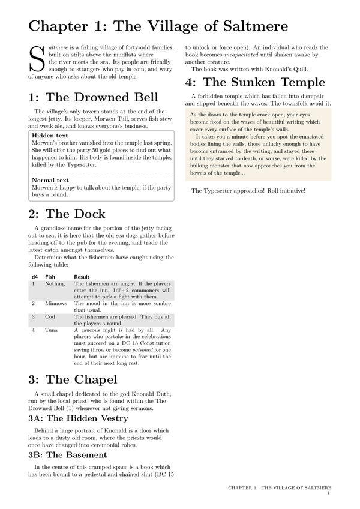
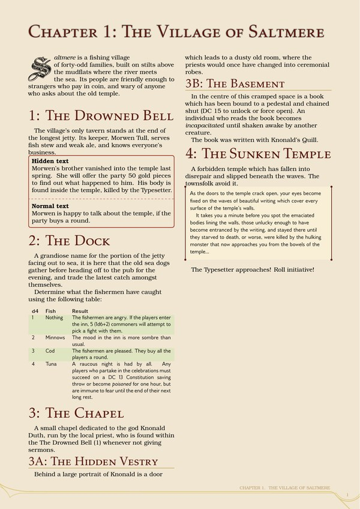
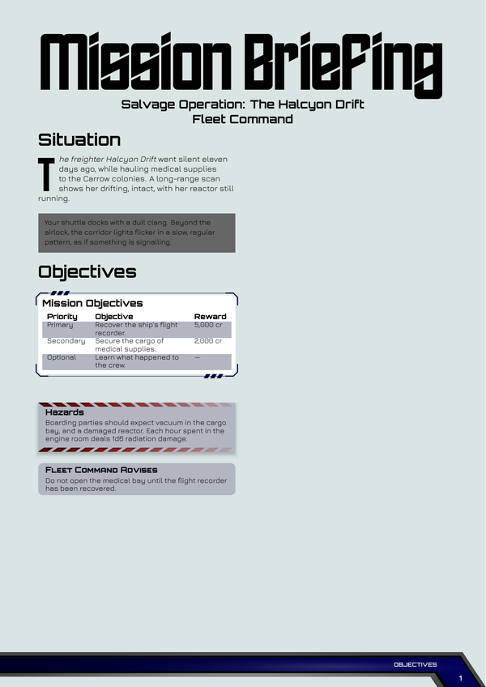
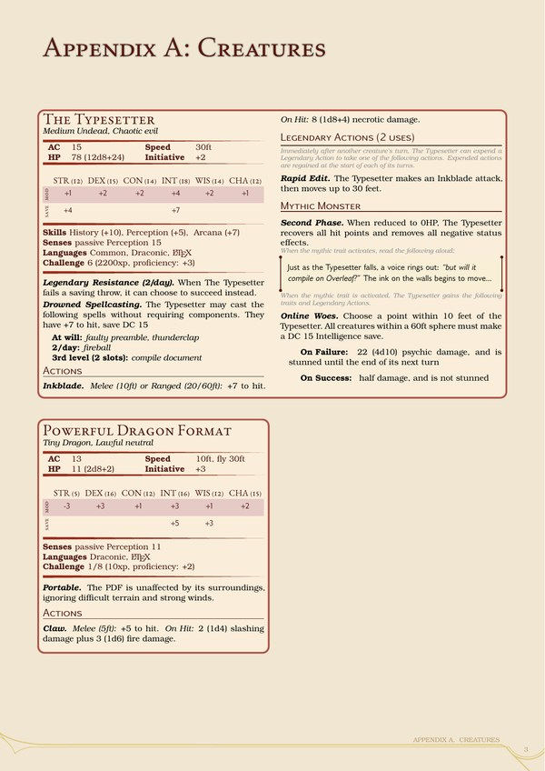
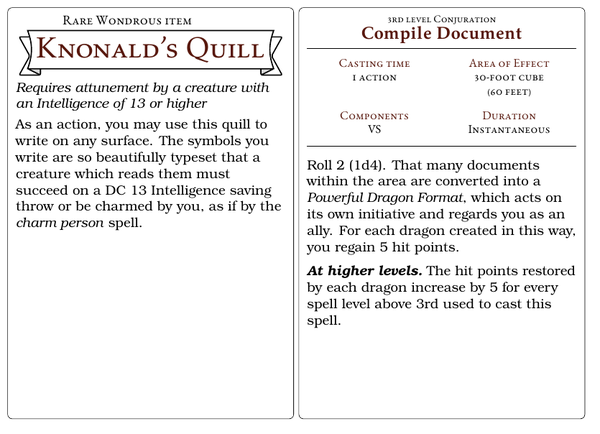

# RPG LaTeX Template

[](https://github.com/DrFraserGovil/rpgtex/releases/latest) 
[](https://raw.githubusercontent.com/DrFraserGovil/rpgtex/main/docs/documentation.pdf) 
[](https://github.com/DrFraserGovil/rpgtex/blob/main/docs/CHANGELOG.md)
[](https://github.com/DrFraserGovil/rpgtex/blob/main/docs/ROADMAP.md)

`rpgtex` is a LaTeX package for typesetting documents for roleplaying games of all kinds: adventures, rulebooks, handouts and cards. It consists of a central 'core', which provides the commands, environments and classes, and a set of 'themes', which control how everything looks. Three themes are provided (`default`, `dnd` and `scifi`), and you can write your own.

## Features

    <!-- The images are generated by scripts/make-readme-images -->

### Document classes

* **`rpgbook`** for adventures and rulebooks, with cover and part pages, two-column layout and decorated footers.
* **`rpghandout`** for shorter documents, such as player handouts.
* **`rpgcard`** for single cards (items, spells, abilities), for use on screen or in print.
* **`rpgdeck`** for gathering cards together into a deck for printing.
* Or load the `rpgtex` package into a document of any class.

### Themes

* **`default`**: a clean, minimal look, close to standard LaTeX.
* **`dnd`**: modelled on the *Dungeons & Dragons* sourcebooks, with parchment pages, a color scheme that changes with each part of the book, and *Player's Handbook* or *Dungeon Master's Guide* style part pages.
* **`scifi`**: angular fonts, a cool grey page, and starship-style footers and frames.
* Themes can be switched part-way through a document, and the documentation includes a full guide to building your own: fonts, colors, page designs, boxes and more.

<p align="center">
  <a href="example/dnd-example"></a>
  <a href="example/dnd-example"></a>
  <a href="example/scifi-example"></a>
  <br><em>The same page in the <code>default</code> and <code>dnd</code> themes, and a briefing in the <code>scifi</code> theme.</em>
</p>

### Text and layout

* **Callout boxes** for sidebars, tips and read-aloud narration, plus a decorative filigree frame that can be applied to any box.
* **Tables** with alternating row colors, titles and page breaking.
* **Dice notation**: `\RpgDice{2d6+3}` collates and formats rolls, and each theme can style them (the `dnd` theme adds the average, as in `10 (2d6+3)`).
* **Maps**: number the areas of a location automatically (including nested areas, such as `1B-iii`), and refer to them by name.
* **Secrets**: write a GM's version and a players' version of the same text, and choose which to print.
* **Drop capitals**, outlined text, whole-page images and other finishing touches.

### Rules content

* **Items, feats, spells and statblocks** (`RpgItem`, `RpgFeat`, `RpgSpell`, `RpgStat`), each of which can be printed as text in the flow of a document, or as a card.
* **D&D statblocks that do the maths**: give a creature's ability scores and challenge rating, and the `dnd` theme works out its modifiers, saving throws, skills, proficiency bonus, experience, attack bonuses and spell save DC. Spellcasting, legendary and mythic actions, full-width statblocks and the classic 5e layout are all supported.
* **Your own rule environments**, with their own properties, text format and card format, in a single command.

<p align="center">
  <a href="example/dnd-example"></a>
  <a href="example/card-example"></a>
</p>

### Tooling

* **`rpglatex`**, a small compiler script which runs the right number of passes, keeps the auxiliary files out of the way, and can switch a document to print mode from the command line.

## Getting Started

We provide [full documentation](https://raw.githubusercontent.com/DrFraserGovil/rpgtex/main/docs/documentation.pdf) for this package, and [example documents](https://github.com/DrFraserGovil/rpgtex/tree/main/example). The following is a brief summary to get you started. We assume that you are familiar with LaTeX, and have a working installation. If not, we recommend [familiarising yourself with it first](https://latex-tutorial.com/tutorials/).

### Installation

The simplest approach is to clone the repository into your personal `texmf` directory, where LaTeX will find it automatically:

```bash
mkdir -p "$(kpsewhich -var-value TEXMFHOME)/tex/latex"
git clone https://github.com/DrFraserGovil/rpgtex.git "$(kpsewhich -var-value TEXMFHOME)/tex/latex/rpgtex"
```

This is typically `~/texmf` on Linux, `~/Library/texmf` on macOS, and `C:\Users\<username>\texmf` on Windows. Other ways of installing, and notes for Windows and MiKTeX users, are given in the documentation.

### Configuration

In most cases, no configuration is needed: `rpgtex` finds its own installation (using `kpsewhich`) when a document is compiled. If this fails, for example because shell escape is disabled, compile with the `rpglatex` compiler, run `scripts/configure-rpgtex`, or create the file `core/rpg-config.cfg` containing the path to the installation:

```tex
\edef\RpgPackagePath{/path/to/rpgtex}
```

### Your first document

```tex
\documentclass[theme=dnd]{rpgbook}

\title{The Sunken Temple}
\author{A. Writer}

\begin{document}
\maketitle

\chapter{Into the Depths}

\begin{RpgNarration}
	The air grows cold as you descend the steps.
\end{RpgNarration}

\begin{RpgStat}{Temple Guardian}[str=18, dex=12, con=16, cr=5]
	\section{Actions}
		\melee{Slam}[dmg=2d8+\RpgStatMod{str}, dmg-type=bludgeoning]
\end{RpgStat}
\end{document}
```

To use `rpgtex` with another class instead, load it as a package: `\usepackage[theme=dnd]{rpgtex}`. The options for the package and the classes are described in the documentation.

### Compilation

`rpgtex` uses `fontspec` to load its fonts, so documents must be compiled with `xelatex` or `lualatex`:

```bash
xelatex main.tex
```

On Linux and macOS, the `rpglatex` compiler can run the passes for you, and open the finished PDF. It is a Python 3 script, `scripts/rpglatex`, which can be linked onto your `PATH`:

```bash
ln -s ~/path/to/rpgtex/scripts/rpglatex ~/.local/bin/rpglatex
rpglatex main.tex
```

## Dependencies

`rpgtex` relies on a number of standard LaTeX packages, all of which are part of a full [TeX Live](https://www.tug.org/texlive/) installation, which we recommend. The full list is given in an appendix of the documentation. The `rpglatex` compiler requires Python 3.

## Credits

This project is forked from [the D&D 5e LaTeX Template](https://github.com/rpgtex/DND-5e-LaTeX-Template) by Evan Bergeron and the rpgtex contributors, and much of its technical foundation is owed to them. The modifications made here update the D&D content to the 2024 rules, and separate the core engine from its appearance, so that other themes (such as `scifi`) can exist alongside it.

Third-party resources are distributed under their own licences:

* The `dnd` paper texture is from [Lost and Taken](https://lostandtaken.com/), via the original template.
* The `scifi` theme bundles the fonts Orbitron, Jura and Fira Sans (SIL Open Font License) and Edge of the Galaxy (CC0).
* The images in the documentation and the examples are credited in the documentation's Image Credits appendix, and in the `ATTRIBUTION.txt` files.

See [LICENSE](LICENSE) for the full list.

## License

`rpgtex` is released under the MIT License. See [LICENSE](LICENSE) for details, including the licences of the third-party resources listed above.
